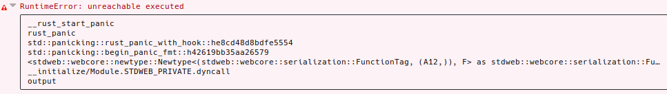

# How to reproduce

Run
```
cargo web start --target=wasm32-unknown-unknown
```
and open `localhost:8000`. Then run the following command on your browser:
```
Rust.xhr_stdweb.then(x => x.test())
```

This will crash with this error:

